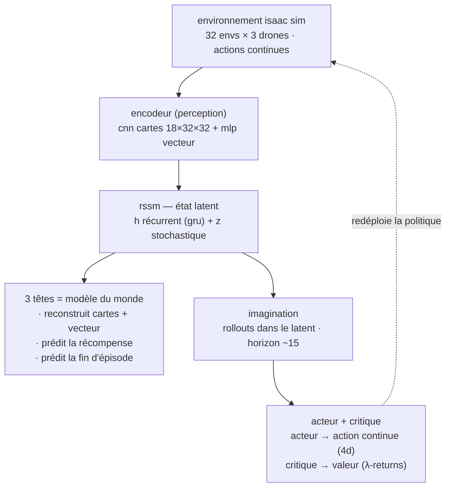

# Analyse Dreamer pour SwarmScan-Map

Évaluation de DreamerV3 comme prochaine étape après PPO, adaptée au setup réel du projet
(32 envs × 3 drones, obs = cartes égocentriques 18×32×32 + vecteur ~90 dims, actions continues
4D, critic privilégié CTDE, GPU 8 Go).

## Architecture (flux de données)

Teal = perception / modèle du monde. Violet = contrôle appris. L'acteur voit le latent
`(h_t, z_t)`, jamais les cartes brutes.

## 1. À quoi consiste ce modèle (DreamerV3, Hafner et al. 2023)

PPO est **model-free** : il apprend directement une politique en essayant des actions dans le
vrai simulateur, et jette les données après chaque mise à jour (on-policy). Dreamer est
**model-based** : il apprend d'abord un *modèle du monde* (une copie apprise du simulateur),
puis entraîne la politique **à l'intérieur de ce modèle**, sans toucher au vrai Isaac.

Le modèle a 4 morceaux :

1. **Encodeur** — transforme l'observation en vecteur compact. Ici : un CNN sur les cartes
   18×32×32 + un MLP sur le vecteur ~90 dims. C'est presque exactement le `_MapNet` actuel de
   `rl_inventory/swarmscan_map/models.py`.
2. **RSSM** (Recurrent State-Space Model) — le cœur. Un GRU qui maintient un état latent en
   deux parties : `h_t` déterministe (mémoire récurrente) et `z_t` stochastique (32
   catégorielles × 32 classes chez DreamerV3). Il apprend à **prédire le prochain latent** à
   partir de l'actuel + l'action. C'est le « simulateur appris ».
3. **3 têtes de prédiction** — à partir du latent : un décodeur qui **reconstruit
   l'observation**, une tête qui **prédit la récompense**, une tête qui **prédit la fin
   d'épisode**. Ces trois pertes forcent le modèle du monde à être fidèle.
4. **Acteur + critique** — ils ne voient **jamais** l'observation brute, seulement le latent
   `(h_t, z_t)`. Ils s'entraînent sur des trajectoires **imaginées** : on part d'un état réel,
   on déroule ~15 pas *dans le modèle* (aucun appel à Isaac), et on met à jour la politique sur
   ces rollouts avec des λ-returns.

Boucle complète : collecter un peu de vrai vécu → mettre à jour le modèle du monde
(reconstruction + récompense + KL) → imaginer des milliers de rollouts → mettre à jour
acteur/critique → redéployer. Répéter.

## 2. Entrées / observations / sorties — mappées sur l'env

Point rassurant : **l'observation actuelle est déjà au format que Dreamer attend.**

| Élément | Env actuel | Ce que Dreamer en fait |
|---|---|---|
| Entrée visuelle | cartes égocentriques 18×32×32 | passe par le CNN de l'encodeur (identique au `_MapNet`) |
| Entrée vecteur | lidar 72 + proprio + coéquipiers (~90 dims) | passe par un MLP encodeur, concaténé au CNN |
| Action | continue 4D : vx, vy, vz, yaw_rate ∈ [-1,1] | sortie de l'acteur, loi normale (Dreamer gère le continu nativement, cf. DMC/MuJoCo) |
| Récompense | dense (couverture + lecture + shaping) | **apprise** par la tête récompense, encodée en twohot |
| Fin d'épisode | mission ≥ 0.95 ou timeout | apprise par la tête « continue » |

**Le visuel est intégré comme aujourd'hui** : CNN → embedding. Seule différence, Dreamer
**reconstruit** aussi les cartes (le décodeur). Signal d'apprentissage riche et gratuit, mais
un décodeur à 18 canaux est un peu plus lourd qu'un décodeur image RGB à 3 canaux.

## 3. Est-ce plus facile à apprendre ?

Trois choses qu'on confond souvent :

**a) Efficacité en échantillons (nombre de pas simulés) — oui, nettement meilleur**, et c'est
décisif ici. La contrainte 8 Go limite à **32 envs**. PPO est on-policy : avec seulement 32
envs, il lui faut énormément de pas simulés car il jette tout après chaque update. Dreamer
garde un **replay buffer** et réutilise chaque transition des dizaines de fois via
l'imagination. Sur benchmarks, Dreamer atteint des scores équivalents avec 10× à 100× moins de
pas d'environnement. Chaque pas Isaac étant cher (physique + raycast), à 32 envs c'est le
meilleur argument pour Dreamer.

**b) Hyperparamètres — plus faciles, en principe.** L'apport central de DreamerV3 est la
**robustesse** : mêmes hyperparamètres sur 150+ tâches sans réglage, grâce à des astuces fixes
(symlog sur les prédictions, twohot pour la récompense, free-bits sur la KL, normalisation des
retours par percentiles). Concrètement, moins de temps de réglage que le tuning fin déjà fait
sur PPO (entropie, ADR, shaping, clamps σ — tout ce qui est commenté dans `config_map.py`).
Réserve : cette promesse « zéro réglage » a été démontrée sur benchmarks standards ; la tâche
ici a curriculum + multi-agent + critic privilégié, donc hors des sentiers battus, et la
promesse y est plus faible.

**c) Temps mur (wall-clock) pour converger — pas forcément plus rapide, possiblement plus lent
par itération.** Chaque pas Dreamer fait beaucoup plus de calcul GPU (forward+backward du
modèle du monde + rollouts d'imagination). Donc : moins de pas simulés, mais chaque cycle
d'apprentissage est plus lourd. À 32 envs le solde penche pour Dreamer ; avec des milliers
d'envs, PPO gagnerait. On est dans le cas favorable.

## 4. Ce qui est réellement PLUS DUR ici (frictions honnêtes)

Par ordre d'importance :

1. **Multi-agent (3 drones).** Dreamer est mono-agent par conception. Voie praticable : **poids
   partagés**, chaque drone est une trajectoire indépendante alimentant un seul modèle du monde
   + acteur partagés — exactement la logique `AGENTS` actuelle. Les coéquipiers apparaissent
   comme obstacles mobiles dans les cartes/vecteur, ce que l'obs encode déjà. Faisable, mais ce
   n'est pas le cadre officiel de Dreamer : à assembler soi-même.

2. **Critic privilégié (CTDE).** Ici le critique voit 7 dims privilégiées que l'acteur ne voit
   pas. Chez Dreamer, le critique s'entraîne sur le **latent imaginé**, pas sur une obs
   privilégiée réelle. Greffer le CTDE dessus n'est pas direct : soit abandonner le critic
   privilégié, soit faire **prédire** l'info privilégiée par le modèle du monde (une tête de
   plus). Vrai point d'architecture à trancher.

3. **Curriculum ADR non-stationnaire.** L'env change en cours de route (seuils de gate,
   dropout, spawns dirigés). Le replay buffer contient alors des transitions d'une **dynamique
   périmée**, et le modèle du monde doit ré-apprendre en continu. Friction réelle avec l'ADR
   bidirectionnel — gérable (vider/pondérer le buffer aux changements de niveau), mais du
   travail.

4. **Décodeur 18 canaux + intégration Isaac.** Reconstruire 18 canaux coûte plus qu'une image
   RGB. Et surtout : PPO est **déjà branché** via rsl_rl. Dreamer, non. Il faut porter une
   implémentation et écrire l'adaptateur Isaac Lab.

## 5. Combien de temps ça prend — trois temps différents

- **Temps de développement/intégration** : le vrai coût. **Des semaines, pas des jours.**
  rsl_rl ne fait pas Dreamer. Partir d'une implémentation PyTorch (`NM512/dreamerv3-torch`, ou
  SheepRL) — éviter le dépôt officiel en JAX, l'interop JAX↔Isaac est pénible. Puis écrire
  l'adaptateur : Isaac donne des tenseurs batchés (32 envs), à brancher sur le replay buffer et
  la boucle collecte/imagination.
- **Temps de simulation (pas d'env)** : **beaucoup moins** que PPO (le gros avantage à 32
  envs).
- **Temps mur jusqu'à convergence** : comparable, peut-être un peu plus lent par itération,
  compensé par moins d'itérations nécessaires.

## 6. Contrainte matérielle 8 Go — verdict ferme

**Oui, ça tient sur 8 Go — à condition d'utiliser la taille S ou M et de garder le replay
buffer en RAM CPU. Non, la taille XL ne passe pas.**

Raisonnement chiffré :

- **Le réseau Dreamer est petit** : DreamerV3 taille S ≈ 12–18 M paramètres. Avec états
  d'optimiseur + activations d'un batch modeste : ~1,5–2,5 Go VRAM. DreamerV3 tourne sur cartes
  8 Go grand public (Atari/DMC), c'est documenté.
- **L'obs n'est pas plus lourde qu'une image standard** : 18×32×32 = 18 432 valeurs,
  comparable à 64×64×3 = 12 288. Encodeur/décodeur ne sont pas un problème mémoire.
- **Point clé favorable** : l'obs vient du **raycast (warp)**, pas du rendu caméra RTX. Isaac
  tourne en headless *sans* renderer lourd. La VRAM est dominée par PhysX + tenseurs, modeste à
  32 envs — la preuve, Isaac + PPO tournent déjà sur ces 8 Go.
- **Seul point tendu** : le **co-hébergement** Isaac (empreinte de base Omniverse/USD,
  plusieurs Go au boot) + modèle du monde + batches d'imagination sur **la même carte**.
  Discipline nécessaire : taille S, batch modéré (ex. 16 séquences × 64 pas), replay sur CPU.
  Si trop juste, **descendre à 16 envs** — Dreamer étant efficace en échantillons, 16 envs
  restent viables, contrairement à PPO.

Conclusion : **faisable, borné, sans magie.** Le mur potentiel n'est pas le réseau Dreamer,
c'est Isaac + Dreamer côte à côte — et la moitié de la preuve existe déjà (Isaac + PPO passent
aujourd'hui).

## 7. Recommandation

Techniquement, Dreamer est un bon choix *pour cette situation particulière* (32 envs, pas cher
en pas simulés = le point faible de PPO ici ; moins de tuning que les clamps/entropie actuels).
Mais le coût n'est **pas** l'apprentissage — c'est **l'intégration** (multi-agent partagé,
critic privilégié à re-penser, curriculum vs replay, adaptateur Isaac). Pas des bloqueurs : des
semaines d'ingénierie.

Deux étapes possibles avant de se lancer :

- **Faisabilité prouvée d'abord** : explorer la littérature (Dreamer multi-agent, Dreamer sur
  Isaac Lab, antécédents) pour un état des lieux « qui a fait quoi, avec quel résultat » — évite
  le « travail liquide ».
- **Ou** un plan d'implémentation détaillé (quel dépôt, quel adaptateur, comment brancher
  obs/action, comment gérer CTDE et curriculum), étape par étape.
