# Comparison report — AIF / Heuristique / NS-3 / Résilience
Generated from `/home/djihene_guitoun/simulation_mc02/logs/runs` (9 runs)

## Résumé

| tag | planner | arch | ns3 | steps | coverage_final | entropy_final | innov_final | active_final | msg_dropped | queue_size | time_to_recovery | durable_count |
| --- | --- | --- | --- | --- | --- | --- | --- | --- | --- | --- | --- | --- |
| aif_cent_baseline | aif | centralized | wifi | 51 | 55.29 | 0.31 | 0.70 | 3 | 0 | 1 | — | 0 |
| aif_cent_baseline | aif | centralized | wifi | 54 | 55.36 | 0.31 | 0.66 | 3 | 0 | 1 | — | 0 |
| heur_cent_baseline | heuristic | centralized | wifi | 80 | 33.14 | 0.48 | 0.22 | 3 | 0 | 1 | — | 0 |
| aif_dist_baseline | aif | distributed | wifi | 53 | 55.37 | 0.31 | 0.71 | 3 | 0 | 6 | — | 0 |
| heur_dist_baseline | heuristic | distributed | wifi | 80 | 40.66 | 0.42 | 0.30 | 3 | 0 | 2 | — | 0 |
| aif_cent_kill_d0_s20 | aif | centralized | wifi | 55 | 53.27 | 0.33 | 0.50 | 2 | 0 | 1 | — | 0 |
| heur_cent_kill_d0_s20 | heuristic | centralized | wifi | 80 | 19.57 | 0.56 | 0.20 | 2 | 0 | 1 | — | 0 |
| aif_cent_cut_cloud_s20 | aif | centralized | wifi | 53 | 55.28 | 0.31 | 0.60 | 3 | 0 | 6 | — | 0 |
| aif_dist_cut_links_s20 | aif | distributed | wifi | 57 | 56.55 | 0.31 | 0.56 | 3 | 108 | 0 | — | 0 |

## Comparaisons systématiques

### AIF vs Heuristique — centralized

Compare la stratégie d'action à environnement égal (sans NS-3, sans cut).

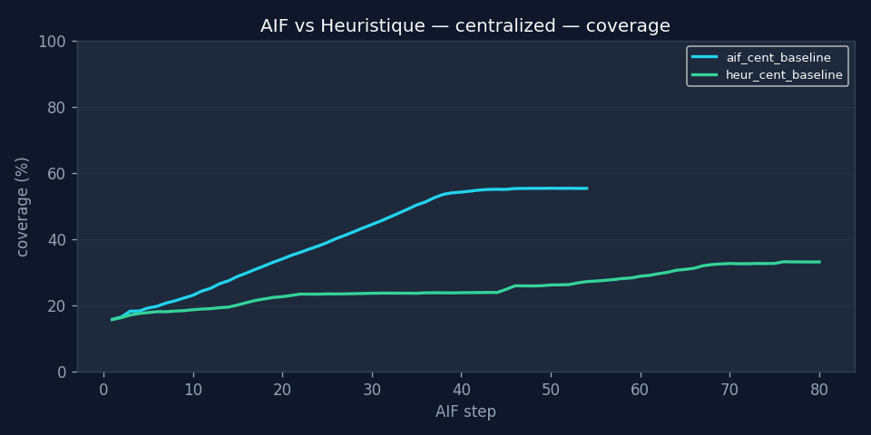

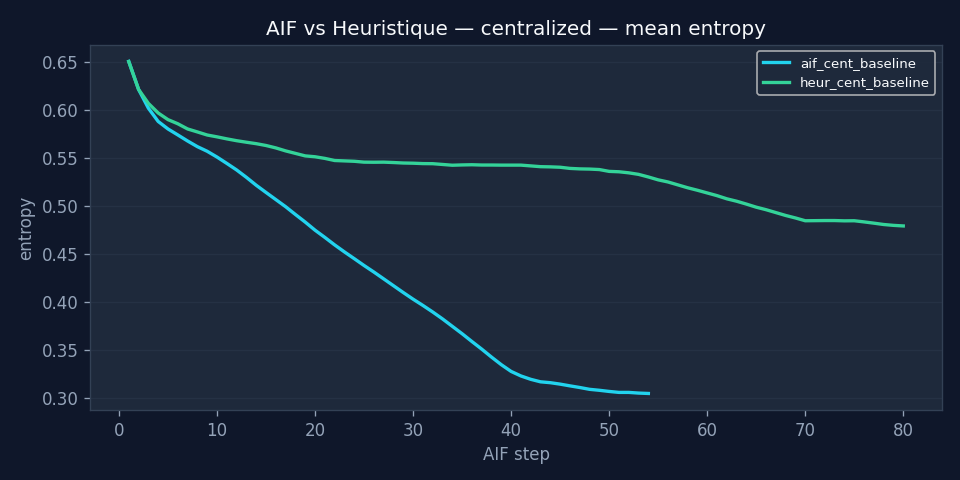

### AIF vs Heuristique — distributed

Même comparaison en architecture distribuée.

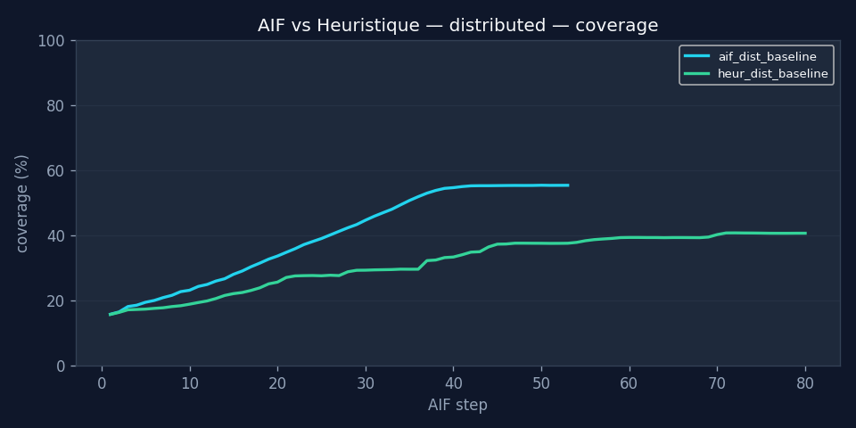

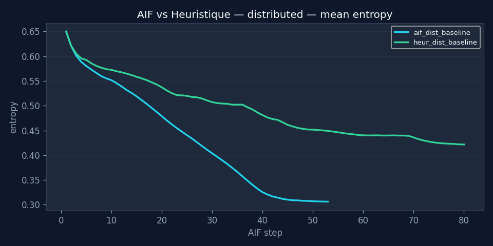

### Centralized vs Distributed — AIF

Impact pur de l'architecture, planner identique.

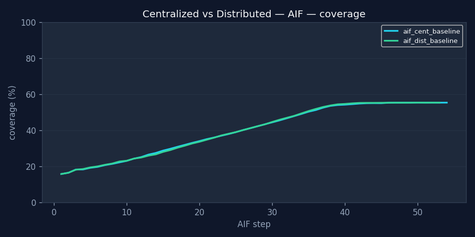

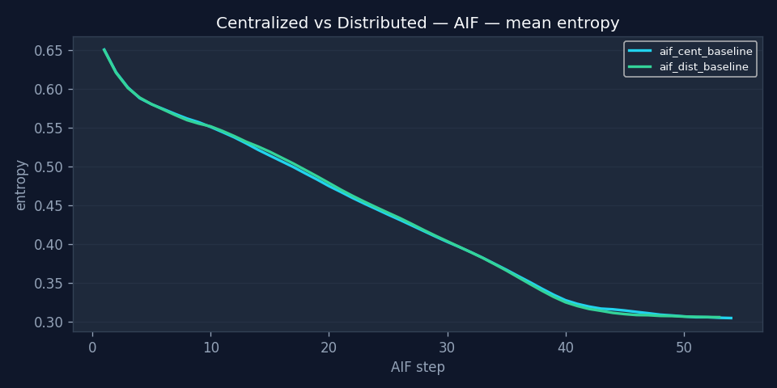

### Centralized vs Distributed — Heuristique

Idem pour le planner heuristique.

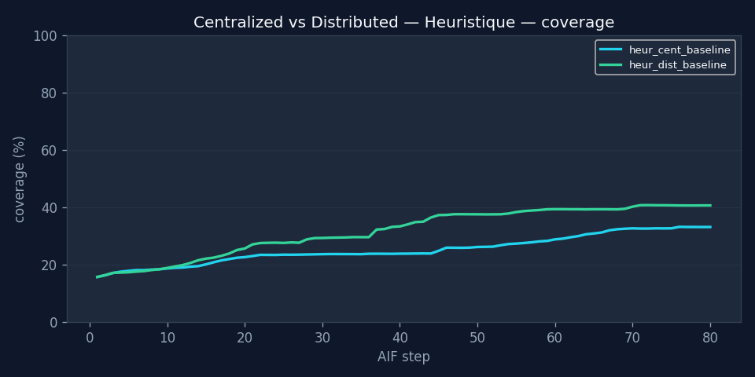

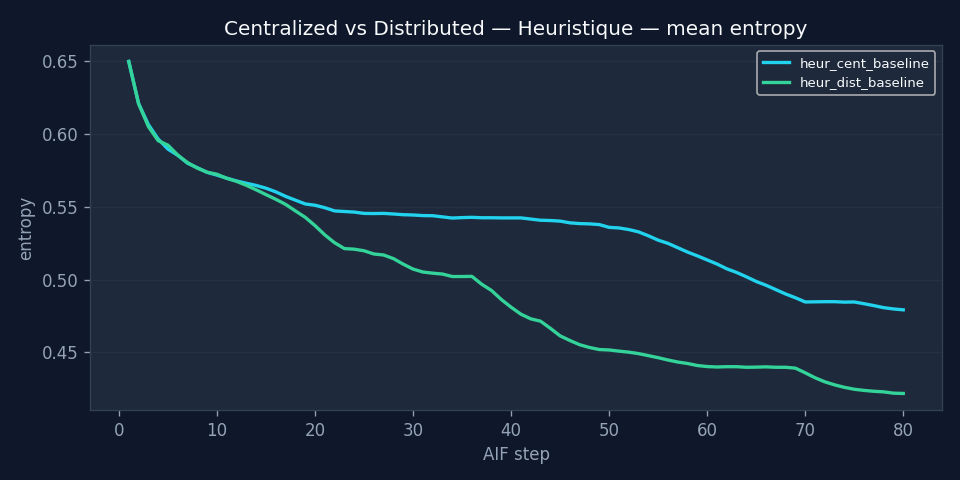

### Impact NS-3 WiFi — AIF/centralized

Ajout de la latence WiFi NS-3.

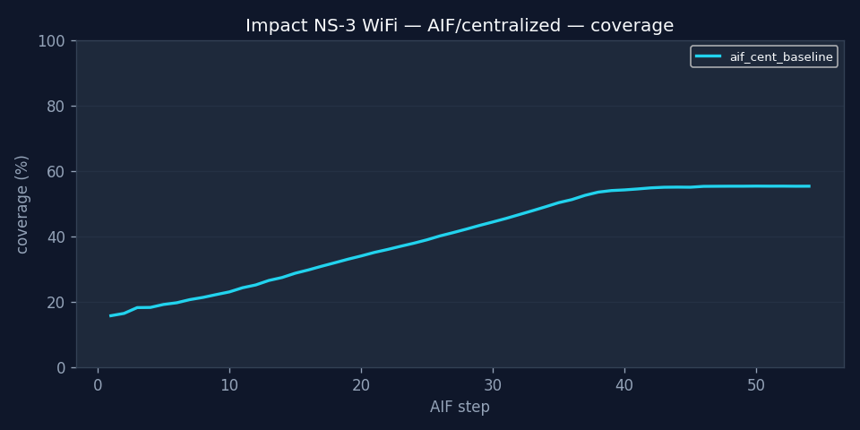

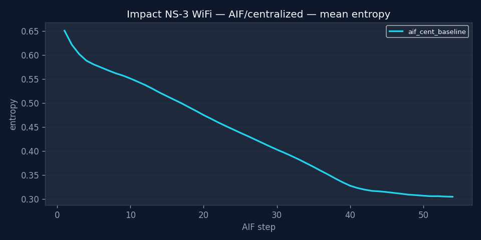

### Impact NS-3 WiFi — AIF/distributed

Idem en distribué.

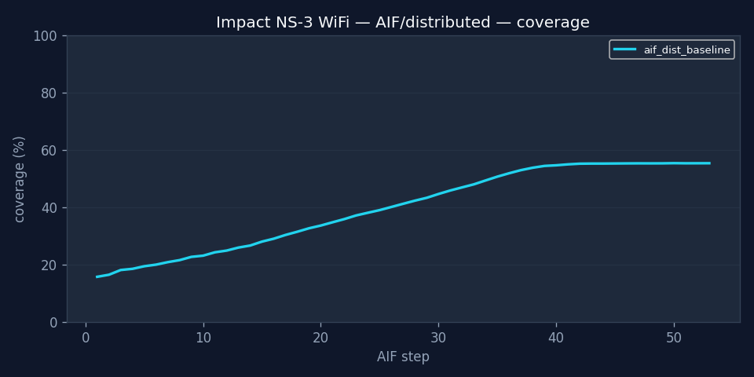

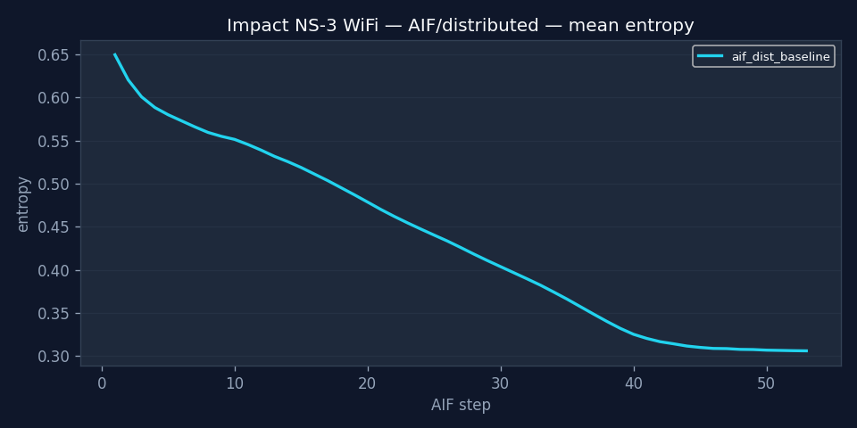

## Courbes de résilience par stresseur

### Perte de drone @20 — AIF vs Heuristique

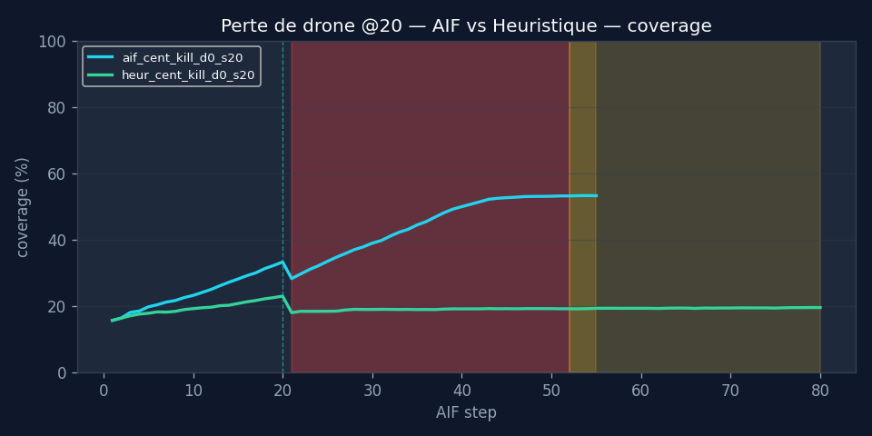

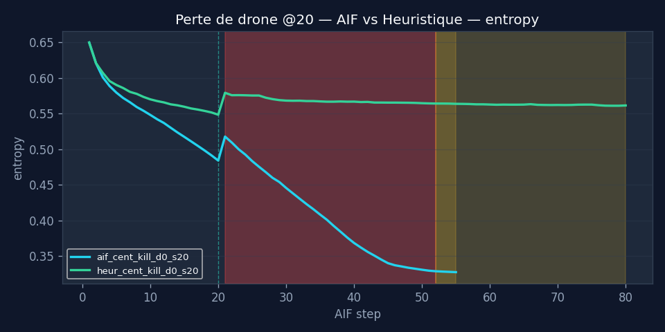

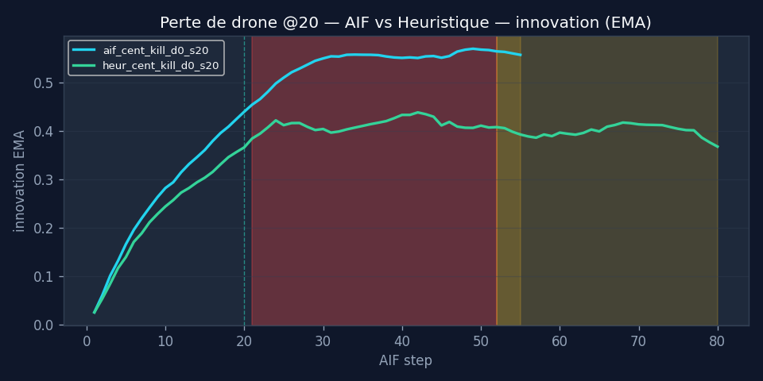

### Cut cloud @20 — auto-failover (AIF/centralized)

_coverage.png)

_entropy.png)

_innovation.png)

### Cut all drone links @20 — autonomie pure (AIF/distributed)

_coverage.png)

_entropy.png)

_innovation.png)

### Multi-stress (cut cloud@15 + kill d1@30)

_coverage.png)

_entropy.png)

_innovation.png)

---
_Generated by `scripts/generate_comparison_report.py`._
